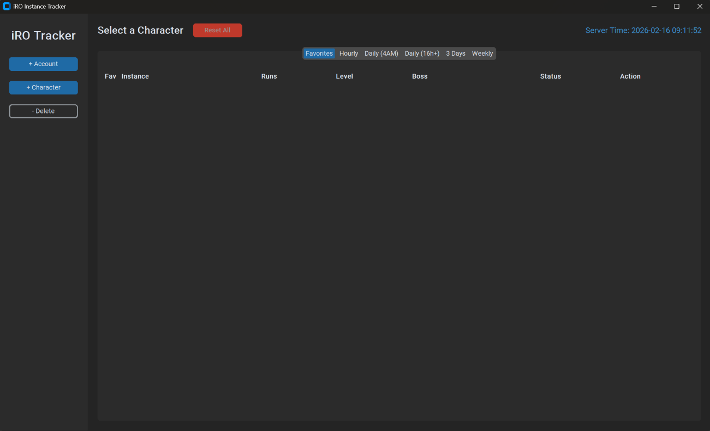

# iRO Instance Tracker 🛡️ 

Modern Desktop GUI application built with Python to track Ragnarok Online (iRO) instance cooldowns. It supports multiple accounts, characters, favorites, run counters, and real-time server synchronization.

<p align="center">
    
</p>

## Key Features

🚀 ***Zero-Lag Interface***: Optimized "Widget Recycling" engine ensures instant switching between characters, even with 50+ instances.

⭐ ***Favorites System***: Mark instances as favorites (★) to see them in a dedicated "Favorites" tab.

📊 ***Run Counter***: Automatically tracks how many times you've completed each instance (Runs: X).

***Multi-Account Support***: Track up to 9 characters per account for multiple accounts.

***Live Server Time***: Displays real-time iRO Server Time (PST/UTC-8).

## Smart Cooldowns 

***Hourly***: (e.g., 1 hour, 16 hours, 23 hours).

***Daily (4 AM)***: Resets at 04:00 Server Time (e.g., OGH, EDDA).

***3 Days***: (e.g., Wolfchev, Nidhoggur).

***Weekly***: (e.g., Endless Tower on Tuesdays).

***Modern GUI***: Built with CustomTkinter for a clean, Dark Mode aesthetic.

***Persistence***: Automatically saves progress (time, favorites, run counts) to iro_instance_data.json.

***Manual Controls***: "Reset All" button for characters or individual reset buttons if clicked by mistake.

## 🛠️ Installation

1. Install Python
Ensure you have Python installed (3.7 or newer). Download it from python.org.

2. Install Dependencies
This project uses customtkinter for the modern interface. Open your terminal (Command Prompt/PowerShell) and run:

```Bash
pip install customtkinter
```

3. Run the App
Download the script (e.g., instance_tracker.py), navigate to the folder, and run:

```Bash
python instance_tracker.py
```

## 📖 How to Use

1. Setting Up
Add Account: Click + Account on the left sidebar (e.g., "MainAccount").
Add Character: Select the account, then click + Character (e.g., "RuneKnight").

2. Tracking & Favorites
Select a Character: Click a name in the sidebar.
Mark Done: Click the "Mark Done" button next to an instance.
The button turns Red (Reset mode) and shows the countdown.
The "Runs" counter increments by 1.
Add Favorite: Click the Star (☆) icon next to any instance. It will turn yellow (★) and appear in the "Favorites" tab for quick access.

3. Managing Cooldowns
Mistake? If you clicked by accident, the button becomes "Reset" (Red). Click it to clear the timer.
Reset All: Use the "Reset All" button in the top header to wipe all timers for the current character (keeps favorites and run counts intact).

## 📂 Data & Backup

All data is stored in iro_instance_data.json in the same folder.
Backup: Copy this file to save your progress.
Migration: The app automatically upgrades old data formats to the new format (adding favorites/run counts) without data loss.
